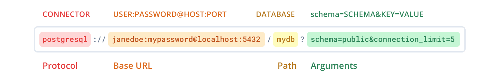

# Environment Configuration

### .env File
- DATABASE_URL: Database URL used for Prisma connection. Image example: 

- DATABASE_USER: Username set for the database when created via Docker Compose. Example: root

- DATABASE_PASSWORD: Password set for the database when created via Docker Compose. Example: root